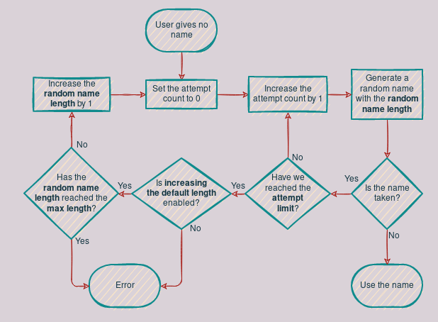

# Configuration

When you run the server, the first (and only) argument should be the path to
the configuration file. This should be a [TOML](https://toml.io) file.

The following options are required:

- [`database.pass`](#user-and-pass)
- [`network.host`](#host)

You are also encouraged to check the following options:

- [`upload_dir`](#upload-dir)
- [`network.address`](#address)
- [`network.port`](#port)
- [`passwords`](#passwords)
- [`frontend_path`](#frontend-path)

You can find an example configuration file showcasing many of the options
[here](./config.example.toml).

## Top level options

These options go at the top level of the TOML file, not within any table:

### `frontend_path`

The path to a web frontend to use. This should point to a folder which contains
an `index.html` file, a `share.html` file, and optionally a `static` folder.

The `index.html` file will be served at the root of the service. The
`share.html` will be served at the share endpoints, when `?v` is appended to
the URL.

This may either be a string or `null` (the default). If it is `null`, then no
frontend will be served. Otherwise, it must be a path which the service can
read.

### `upload_dir`

The path to the directory where files will be uploaded. This should be a
directory that the service can read and write to. This defaults to
`/var/lib/shareit/shares`, but you may wish to change it to
`/srv/shareit/shares` or anything else.

This must be a string. It must be configured on Windows, but the default
may be suitable on Linux and other Unix-like systems.

### `highlighting_languages`

An array of languages that can be used for syntax highlighting of pastes.

The default value contains the 191 languages supported by
[highlight.js](https://highlightjs.org/) as of August 2021, as well as `auto`,
intended to indicate to the frontend that the language should be detected
automatically.

### `default_highlighting_language`

The default language for syntax highlighting of pastes, when one is not given.

The default for this is `auto`. It must be a string.

### `default_mime_type`

The default MIME type for uploaded files.

The default for this setting is `application/octet-stream`, which indicates
unknown binary data. It must be a string.

### `expiry_check_interval`

The interval at which the service will check for expired shares. This is only
used for clearing unused data (and share names), expired shares will still be
deleted if they are attempted to be accessed.

The default value for this is `1 min`. It must be a string. It supports a
variety of units, including `s[econds]`, `m[inutes]`, `h[ours]`, `d[ays]`,
`w[eeks]`, `M[onths]` and even `y[ears]`.

### `passwords`

An array of passwords for accessing the service. If set, one of the provided
passwords must be used to create shares. The default is an empty array, which
means no passwords are required.

Note that this only protects creating shares - anyone can access them.

## Database options

These options go in a table named `database`. The database must be a PostgreSQL
database.

### `host` and `port`

The hostname (string) and port (integer) to access the database at. These
default to `localhost` and `5432` respectively.

### `user` and `pass`

The username and password to connect to the database with. These are strings.

The username defaults to `shareit`, but the password is required.

### `name`

This is the name of the database to use. It defaults to `shareit`, and must be
a string.

## Network options

These options go in a table named `network`.

### `address`

The address to bind to. This defaults to `127.0.0.1`, but you'll probably want
to change it to `0.0.0.0` to make it accessible from the Internet, unless you
are hosting the service behind a reverse proxy.

This must be a string.

### `port`

The port to listen on. This defaults to `8000`, but you may want to change it
to `80`, as this is the convential port for HTTP.

Note that SSL is not currently supported so port `443` is probably not
appropriate.

### `host`

The address at which this service can be accessed from the outside internet,
used for generating URLs to shares. This should include the scheme, which must
be either `http` or `https`.

This option is required, and must be a string.

## User restrictions

These options configure limits on what users can do with the service. They go
in a table named `restrictions`.

### `max_upload_size`

The maximum file size for pastes and files. This defaults to `2 MB`. This must
be a string.

### `max_link_length`

The maximum length of a link to be shortened. This defaults to `255`, but can
be as high as `2047`. It must be an integer.

### `max_expiry_time`

The maximum time a share can be kept for. This can either be `null` (the
default), or a string.

If it is `null`, there is no limit, though a user can still specify a shorter
expiry time for their own shares. If it is a string, the same units are allowed
as for [`expiry_check_interval`](#expiry_check_interval).

### `allow_updates`

Whether or not users can update and delete their own shares. This defaults to
`true`. To disable it, set this to `false`.

### `allowed_mime_types` and `disallowed_mime_types`

These options allow you to restrict the MIME types for uploaded files.

They are both arrays of strings. If `allowed_mime_types` is not empty,
`disallowed_mime_types` will be ignored, and only the MIME types in
`allowed_mime_types` will be allowed.

Otherwise, all MIME types not in `disallowed_mime_types` will be allowed.

By default, `disallowed_mime_types` contains `text/html`, to prevent users
from uploading HTML files that look like web pages.

### `allowed_link_schemes`

The link schemes that are allowed for links to be shortened. This must be an
array of strings, and the default is `["http", "https"]`. To allow any scheme,
set it to the empty array (`[]`).

## Share naming options

These options configure how shares are named. They go in a table named `names`.

### `allow_custom`

Whether or not users can specify their own names for their shares. This
defaults to `true`. To disable it, set this to `false`.

### `min_length` and `max_length`

The minimum and maximum length of a share name. These default to `1` and `32`
respectively. The maximum length that can be configured is `255`. These must
be integers.

### `random_length` and `random_attempt_limit`

These configure how random name generation behaves. The default for
`random_length` is `8` and the default for `random_attempt_limit` is `3`.

In short, `random_length` is the length to start generating random names with,
and `random_attempt_limit` is the number of random collisions that must occur
before increasing that length.

Here's a diagram to explain how random name generation works:

Or in text form:

1. Set the attempt count to 0.
2. Increase the attempt count by 1.
3. Generate a random name with the random name length.
4. If the name is available, use it, otherwise, continue.
5. If the attempt count is below the attempt limit, go back to step 2, otherwise, continue.
6. If increasing the default length is disabled, error, otherwise, continue.
7. If the random name length has reached the max length, error, otherwise, continue.
8. Increase the random name length by 1.
9. Go back to step 1.
